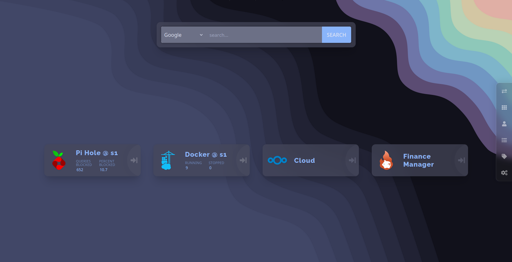

<h3 align="center">
	
	Pastel theme for <a href="https://github.com/linuxserver/Heimdall/">Heimdall</a>
	
</h3>

	

# A Pastel Theme For Heimdall

A nice dark pastel theme for your Heimdall dashboard.

## Installation

1. Copy contents of [style.css](https://github.com/) file, then paste it into your Heimdall in Settings -> Custom CSS.
2. _(Optional)_ Download [wallpaper.png](https://github.com/) file, then set it as your Heimdall background in Settings -> Background Image. Also you can use any other wallpaper as the background that matches the color palette.
